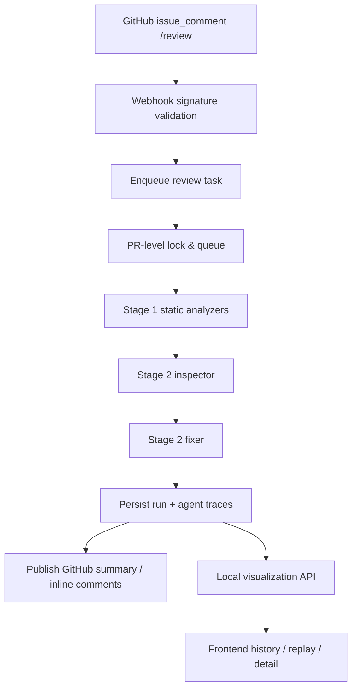

# GitHub PR Auto Review

An MVP GitHub App service that listens for `/review` comments on pull requests, runs Stage 1 static checks plus Stage 2 LLM review, and posts summary and inline review comments back to GitHub.

## Architecture



## What It Does

- Listens for GitHub `issue_comment` webhooks at `POST /webhooks/github`
- Only triggers when the comment body is exactly `/review`
- Pulls the PR diff and changed file contents through the GitHub App installation
- Runs Stage 1 checks:
  - broad exception swallowing in diffs
  - Python `None` dereference heuristics
  - missing `await`
  - blocking calls inside `async def`
  - resource leak heuristics
- Runs Stage 2 LLM review through an OpenAI-compatible API
- Queues review runs with PR-scoped serialization and multi-PR parallelism
- Recovers queued/running tasks after process restart
- Posts:
  - one PR summary comment
  - zero or more inline review comments

## Technical Highlights

- PR-scoped serialization with multi-PR concurrency: same PR is locked and queued, different PRs can run in parallel.
- Durable review history: every run stores task payloads, agent traces, summaries, rendered comments, and replay metadata.
- Dual-agent review pipeline: inspector confirms defect reality, fixer generates minimal suggestions, with validation and fallback recovery for partial model outputs.
- Stale-run suppression: queued/running tasks are rechecked against the latest `head.sha` before comment publication.
- Local observability loop: the UI exposes review history, agent traces, model replay, and final findings for postmortem analysis.

## Problems Solved

- Prevents duplicate or overlapping reviews on the same PR.
- Avoids publishing stale comments after the PR head advances.
- Preserves review history across container restarts.
- Keeps model output failures from collapsing the entire review result into a degraded pass.
- Makes agent collaboration debuggable through persisted traces and replayable runs.

## Deployment Layout

- Single-container deployment for production: FastAPI serves both `/api/*` endpoints and the built frontend from `frontend/dist`.
- Local development can still run split-mode: backend on `:8000`, Vite dev server on `:4173`.
- Render deployment target: one Docker-based web service, with the same container shape used locally.
- Persistent data: review history is stored in SQLite at `.data/review_runs.db`, or in the `review-data` Docker volume when using Compose.

## Project Structure

```text
.
├─ app/                         # FastAPI app, review pipeline, GitHub integration, persistence
│  ├─ github/                   # Webhook parsing and GitHub service integration
│  ├─ llm/                      # OpenAI-compatible LLM client abstraction
│  ├─ persistence/              # SQLite-backed review run repository
│  ├─ prompts/                  # Structured review prompt builders
│  ├─ review/                   # Orchestration, rendering, queueing, replay flow
│  ├─ rules/                    # Diff rules, Python AST checks, Semgrep adapter
│  └─ visualization/            # Local monitoring and replay API
├─ frontend/                    # React + Vite dashboard UI
│  └─ src/
├─ scripts/                     # Local review and utility scripts
├─ tests/                       # Unit and integration tests
├─ .github/workflows/           # CI pipeline
├─ Dockerfile                   # Unified frontend + backend image
├─ docker-compose.yml           # Local multi-command orchestration and data volume
├─ SPEC.md                      # Design specification
├─ PLAN.md                      # Task-level implementation plan
├─ SPEC_PROCESS.md              # Spec generation and cold-start validation process
├─ AGENT_LOG.md                 # Agent workflow log
└─ REFLECTION.md                # Final reflection report
```

## Requirements

- Python `3.11+`
- Docker Desktop or Docker Engine
- A GitHub App installed on the target repository
- An OpenAI-compatible LLM endpoint

## 1. Clone And Prepare

```powershell
git clone <your-repo-url>
copy .env.example .env
```

Fill `.env` with real values:

- `GITHUB_WEBHOOK_SECRET`
- `GITHUB_APP_ID`
- `GITHUB_PRIVATE_KEY`
- `GITHUB_INSTALLATION_ID`
- `LLM_API_KEY`

Notes:

- `GITHUB_PRIVATE_KEY` should be a single-line value with literal `\n`
- `LLM_BASE_URL` defaults to Volcengine Ark in `.env.example`
- `LLM_MODEL` defaults to `deepseek-v4-flash-260425`
- `ALLOWED_LLM_MODELS` can be a comma-separated list if you want to override the default model whitelist

## 2. Configure The GitHub App

Recommended GitHub App settings:

- Repository permissions:
  - `Contents: Read-only`
  - `Pull requests: Read and write`
  - `Issues: Read-only`
- Subscribe to webhook events:
  - `Issue comment`

Webhook URL must point to:

```text
https://<your-public-url>/webhooks/github
```

The service only reacts to PR comments. Normal issue comments are ignored.

## 3. Start The Service

This repository already includes DNS settings in `docker-compose.yml` because some Docker environments incorrectly resolve `github.com` and `api.github.com`.

Single-image Docker commands:

```powershell
docker build -t github-pr-auto-review .
docker run --rm -p 8000:8000 --env-file .env github-pr-auto-review
```

Open:

```text
http://127.0.0.1:8000
```

Start with:

```powershell
docker compose up -d --build
```

Stop with:

```powershell
docker compose down
```

Check container status:

```powershell
docker ps
docker logs github-pr-auto-review
```

Health check:

```powershell
curl http://127.0.0.1:8000/health
```

Expected response:

```json
{"status":"ok"}
```

The local review history database is stored at `.data/review_runs.db`.
When using Docker Compose, it is persisted through the `review-data` named volume.

## 4. Expose The Webhook Publicly

If you run locally, you still need a public URL for GitHub webhooks. You can use a tunnel such as `localtunnel`, `ngrok`, or another reverse tunnel.

After you get the public URL, update the GitHub App webhook URL to:

```text
https://<public-url>/webhooks/github
```

## 5. End-To-End Test

1. Open a PR in a repository where the GitHub App is installed.
2. Comment:

```text
/review
```

3. Watch the service log:

```powershell
docker logs -f github-pr-auto-review
```

Expected behavior:

- webhook request returns `202 Accepted`
- the PR receives a summary comment
- if findings are produced, the PR also receives inline review comments

## 6. Local Visualization

The visualization UI is already integrated into the Docker image and the Render deployment.
If the service is running through Docker Compose, `docker run`, or Render, just open your service url


The UI reads these backend endpoints:

- `GET /api/review-runs`
- `GET /api/review-runs/{review_run_id}`
- `GET /api/models`
- `POST /api/review-runs/{review_run_id}/replay`

If you only want to debug the frontend separately during development, you can still run Vite manually, but that is optional and not required for normal local or cloud deployment.

## 7. Optional Connectivity Checks

Verify GitHub access from inside the container:

```powershell
docker exec github-pr-auto-review uv run python -c "from app.config import Settings; from github import Auth, GithubIntegration; s=Settings(); auth=Auth.AppAuth(s.github_app_id, s.github_private_key); gh=GithubIntegration(auth=auth).get_github_for_installation(int(s.github_installation_id)); pr=gh.get_repo('karendirecter/notion-lite').get_pull(2); print(pr.title); print(pr.html_url); print(pr.head.sha)"
```

Verify LLM access from inside the container:

```powershell
docker exec github-pr-auto-review uv run python -c "from openai import OpenAI; from app.config import Settings; s=Settings(); c=OpenAI(base_url=s.llm_base_url, api_key=s.llm_api_key); r=c.chat.completions.create(model=s.llm_model, messages=[{'role':'user','content':'Reply with the single word OK'}]); print(r.choices[0].message.content)"
```

## 8. Run Tests

Local test command:

```powershell
uv run pytest -q
```

## 9. CI/CD

GitHub Actions is configured in `.github/workflows/ci.yml` and runs on every `push`, every `pull_request`, and manual `workflow_dispatch`.

The workflow leaves visible checks on GitHub for three independent jobs:

- `Backend Tests`: installs Python dependencies with `uv` and runs `uv run pytest -q`
- `Frontend Build`: installs frontend dependencies with `npm ci --prefix frontend` and runs `npm run --prefix frontend build`
- `Docker Build`: runs `docker build -t github-pr-auto-review:ci .`

This matches the course requirement that CI automatically runs tests and verifies that the Docker image can be built for each push.

## 10. Known Limitations

- The current webhook path only supports `/review` comment-triggered review
- The container DNS fix is encoded in `docker-compose.yml`; if you use raw `docker run`, you need equivalent DNS settings yourself
- Some LLM responses may still include weak or noisy findings; the current system prioritizes getting a real review flow running end-to-end
- Model switching is limited to the built-in whitelist and only changes the model name, not the base URL, so the selected models must all be supported by the configured API provider
- Docker image validation depends on external registry connectivity; in restricted networks, `docker build` may fail before the project code is even evaluated, while deployment on Render or another overseas cloud service is usually more reliable
